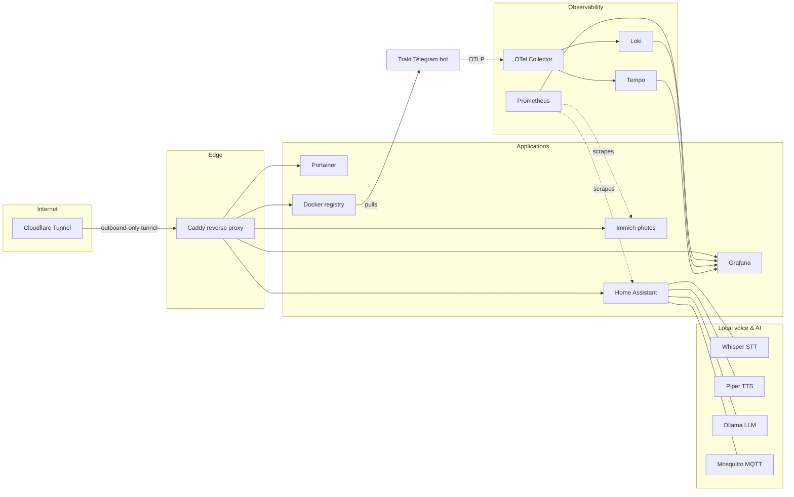

# 🏠 Homelab

Infrastructure-as-code for my single-node homelab: ~25 containers across five
Docker Compose stacks (plus a self-deploying app stack), published to the
internet through a Cloudflare Tunnel and fully observable with a
Grafana/Prometheus/Loki/Tempo stack.

Everything needed to rebuild the server from scratch lives in this repo.
Pushing to `main` deploys: GitHub Actions builds config-baked images, pushes
them to GHCR and updates the affected Portainer stacks through the Cloudflare
Tunnel. Only the data stays on the machine; deploy secrets live in GitHub
Actions secrets.

## Architecture



No inbound ports are open on the router: `cloudflared` maintains an
outbound-only tunnel to Cloudflare, which routes `*.{domain}` hostnames to
Caddy, which reverse-proxies to each service over a shared Docker bridge
network (`internal`). TLS terminates at Cloudflare's edge.

## Stacks

| Stack | What it runs | Why |
|---|---|---|
| [caddy/](caddy/) | Caddy 2.8 + cloudflared | Reverse proxy + zero-open-ports internet exposure |
| [immich/](immich/) | Immich v3, Postgres (pgvector), Valkey, ML service | Self-hosted Google Photos replacement with on-device ML |
| [home-assistant/](home-assistant/) | Home Assistant, Mosquitto, Whisper, Piper, Ollama, Copilot bridge | Smart home with a fully local voice assistant pipeline (STT → LLM → TTS) |
| [monitoring/](monitoring/) | Prometheus, Grafana, Loki, Tempo, OTel Collector, Promtail, cAdvisor, node-exporter | Metrics, logs, and traces for the host and every container |
| [registry/](registry/) | Docker Registry 2 | Private image registry for my own builds |
| [portainer/](portainer/) | Portainer CE | Container management UI |

One more stack runs on the server but is deliberately **not** defined here:
[traktv-tg-bot](https://github.com/lorainemg/traktv-tg-bot) (my Telegram bot
for Trakt.tv + Postgres 17 + Aspire dashboard) generates its compose file
with .NET Aspire and deploys itself from its own repo's CI via the Portainer
API — the same pattern this repo uses for the infrastructure stacks. This
repo only documents the seam (the monitoring stack joins its network to
collect telemetry).

Highlights:

- **Local voice assistant** — Home Assistant's Assist pipeline wired to
  Wyoming Whisper (speech-to-text), Wyoming Piper (text-to-speech) and a local
  Llama 3.2 model served by Ollama. No cloud round-trip.
- **Full observability** — the Trakt bot ships traces/logs over OTLP to an
  OpenTelemetry Collector that fans out to Tempo, Loki and an Aspire
  dashboard; Prometheus scrapes the host, every container (cAdvisor), Home
  Assistant and Immich; Grafana ties it all together.
- **Self-hosted CI artifact flow** — the
  [Trakt bot](https://github.com/lorainemg/traktv-tg-bot)'s images are built
  by .NET Aspire's deployment pipeline in GitHub Actions and pushed to the
  self-hosted registry the server then pulls from.

## Repo layout

```
├── .github/workflows/deploy.yml   change detection → image builds → stack deploys
├── caddy/            docker-compose.yml, Dockerfile, Caddyfile, deploy.env
├── immich/           docker-compose.yml, deploy.env
├── home-assistant/   docker-compose.yml, .env.example
│   ├── ha-config/    HA yaml config (automations, scripts, scenes, ...)
│   └── mosquitto/    mosquitto.conf (passwd file is generated, not committed)
├── monitoring/       docker-compose.yml
│   ├── prometheus/   Dockerfile, prometheus.yml, entrypoint (HA token via env)
│   ├── promtail/     Dockerfile, promtail.yml
│   ├── tempo/        Dockerfile, tempo.yml
│   └── otelcol/      Dockerfile, otel-collector.yml
├── registry/         docker-compose.yml
├── portainer/        docker-compose.yml
└── scripts/          bootstrap.sh, pre-commit (gitleaks)
```

Conventions:

- **Config baked into images, state on disk.** Pure config (Caddyfile,
  Prometheus/OTel/Promtail/Tempo configs) is baked into thin images
  (`FROM upstream` + `COPY config`) built by CI and published to GHCR, so a
  stack needs nothing from the host but its volumes. Stateful directories
  (photo library, HA runtime, Ollama models, databases) live under a data
  root (`/data` by default).
- **Secrets never in git.** Runtime secrets are GitHub Actions secrets,
  injected into each stack's environment at deploy time; committed
  `deploy.env` files hold the non-secret variables. The one file-based
  secret (Prometheus's HA token) is materialized at container start from an
  env var by its entrypoint. A gitleaks pre-commit hook backstops it all.

## Rebuilding from scratch

1. Install Docker Engine + the Compose plugin; mount/create the data disk at
   `/data`.
2. Restore the data directories from backup (Immich library + DB, HA config,
   etc.) — or start fresh.
3. Create the shared network and start Portainer:
   `docker network create internal && docker compose --project-directory portainer up -d`,
   then expose it through a Cloudflare Tunnel (point the tunnel's public
   hostnames — `portainer.<domain>`, `immich.<domain>`, `grafana.<domain>`, … —
   at `http://caddy:80`; Portainer needs to be reachable by GitHub Actions).
4. Set the repo's Actions secrets: `PORTAINER_URL`, `PORTAINER_API_TOKEN`
   (Portainer → My account → Access tokens), `CLOUDFLARE_TUNNEL_TOKEN`,
   `GRAFANA_ADMIN_PASSWORD`, `HA_TOKEN`, `DB_PASSWORD`.
5. Run the **Deploy** workflow (workflow_dispatch) — it builds every image
   and (re)creates every stack.
6. Mosquitto users are the one manual step:
   `docker exec mosquitto mosquitto_passwd -c /mosquitto/config/passwd homeassistant`

To run without Portainer/CI at all: copy each stack's `.env.example` to
`.env`, fill it in, and run `./scripts/bootstrap.sh` — the compose files work
standalone since the images are public.

Home Assistant's HACS custom components (`better_thermostat`, `browser_mod`,
`extended_openai_conversation`, `hacs`, `monitor_docker`, `roborock_custom_map`,
`smartrent`, `teamtracker`, and friends) are reinstalled through
[HACS](https://hacs.xyz/) rather than committed — the 128 MB of vendored
code doesn't belong in git.

## Contributing to it (a.k.a. me, later)

Enable the secret-scanning hook once per clone:

```sh
cp scripts/pre-commit .git/hooks/pre-commit && chmod +x .git/hooks/pre-commit
```

## CI/CD ([deploy.yml](.github/workflows/deploy.yml))

Every push to `main` runs the pipeline on a GitHub-hosted runner:

1. **Change detection** — [dorny/paths-filter](https://github.com/dorny/paths-filter)
   maps the diff to the affected stacks and fans them out as a job matrix.
   Untouched stacks aren't redeployed.
2. **Image builds** — a second paths-filter decides, per image, whether its
   config actually changed; only then does
   [docker/build-push-action](https://github.com/docker/build-push-action)
   rebuild and push it to `ghcr.io/lorainemg/homelab/*` (tagged `latest` +
   commit SHA for rollbacks). A Caddyfile tweak rebuilds one image, not five.
3. **Stack deploys** —
   [cssnr/portainer-stack-deploy-action](https://github.com/cssnr/portainer-stack-deploy-action)
   updates the stack through the Portainer API (reached via the Cloudflare
   Tunnel), passing the stack's committed `deploy.env` plus its secrets as
   environment variables. Stacks stay fully editable in Portainer's UI.

`workflow_dispatch` deploys everything unconditionally — the
fresh-server / changed-secrets button.

The `home-assistant` stack is the exception: it's a Portainer git-backed
stack (its config is bind-mounted host state, not baked into an image). One
CE quirk applies: build contexts resolve on Portainer's filesystem, where the
host's data root is mounted at `/external/data`, so the stack sets
`COPILOT_BRIDGE_CONTEXT=/external/data/home-assistant/Github-Copilot-SDK-integration/addon`.
