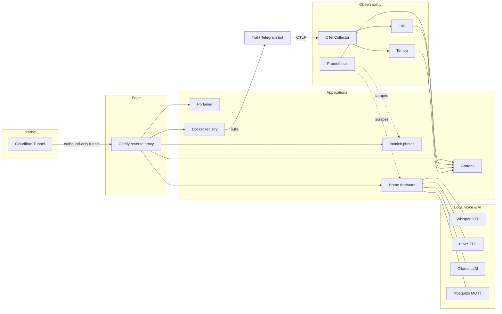

# 🏠 Homelab

Infrastructure-as-code for my single-node homelab: ~25 containers across 6
Docker Compose stacks, published to the internet through a Cloudflare Tunnel
and fully observable with a Grafana/Prometheus/Loki/Tempo stack.

Everything needed to rebuild the server from scratch lives in this repo —
except the data and the secrets, which stay on the machine.

## Architecture



No inbound ports are open on the router: `cloudflared` maintains an
outbound-only tunnel to Cloudflare, which routes `*.{domain}` hostnames to
Caddy, which reverse-proxies to each service over a shared Docker bridge
network (`internal`). TLS terminates at Cloudflare's edge.

## Stacks

| Stack | What it runs | Why |
|---|---|---|
| [caddy/](caddy/) | Caddy 2.8 + cloudflared | Reverse proxy + zero-open-ports internet exposure |
| [immich/](immich/) | Immich v3, Postgres (pgvector), Valkey, ML service | Self-hosted Google Photos replacement with on-device ML |
| [home-assistant/](home-assistant/) | Home Assistant, Mosquitto, Whisper, Piper, Ollama, Copilot bridge | Smart home with a fully local voice assistant pipeline (STT → LLM → TTS) |
| [monitoring/](monitoring/) | Prometheus, Grafana, Loki, Tempo, OTel Collector, Promtail, cAdvisor, node-exporter | Metrics, logs, and traces for the host and every container |
| [registry/](registry/) | Docker Registry 2 | Private image registry for my own builds |
| [trakt-bot/](trakt-bot/) | My Telegram bot for Trakt.tv + Postgres 17 + Aspire dashboard | Personal project, deployed via .NET Aspire to the private registry, instrumented with OpenTelemetry |
| [portainer/](portainer/) | Portainer CE | Container management UI |

Highlights:

- **Local voice assistant** — Home Assistant's Assist pipeline wired to
  Wyoming Whisper (speech-to-text), Wyoming Piper (text-to-speech) and a local
  Llama 3.2 model served by Ollama. No cloud round-trip.
- **Full observability** — the Trakt bot ships traces/logs over OTLP to an
  OpenTelemetry Collector that fans out to Tempo, Loki and an Aspire
  dashboard; Prometheus scrapes the host, every container (cAdvisor), Home
  Assistant and Immich; Grafana ties it all together.
- **Self-hosted CI artifact flow** — the bot's images are built by .NET
  Aspire's deployment pipeline and pushed to the self-hosted registry the
  server then pulls from.

## Repo layout

```
├── caddy/            docker-compose.yml, Caddyfile, .env.example
├── immich/           docker-compose.yml, .env.example
├── home-assistant/   docker-compose.yml, .env.example
│   ├── ha-config/    HA yaml config (automations, scripts, scenes, ...)
│   └── mosquitto/    mosquitto.conf (passwd file is generated, not committed)
├── monitoring/       docker-compose.yml, .env.example
│   ├── prometheus/   prometheus.yml (+ secrets/ha_token, not committed)
│   ├── promtail/     promtail.yml
│   ├── tempo/        tempo.yml
│   └── otelcol/      otel-collector.yml
├── registry/         docker-compose.yml
├── trakt-bot/        docker-compose.yml, .env.example
├── portainer/        docker-compose.yml
└── scripts/          bootstrap.sh, pre-commit (gitleaks)
```

Conventions:

- **Config in git, state on disk.** Pure config (Caddyfile, Prometheus/OTel
  configs) is bind-mounted straight from this repo. Stateful directories
  (photo library, HA runtime, Ollama models, databases) live under a data
  root (`/data` by default) referenced via `${DATA_ROOT}`.
- **Secrets never in git.** Every stack has a committed `.env.example` and a
  gitignored `.env`. File-based secrets (Prometheus's HA token, Mosquitto's
  passwd) sit in gitignored paths. A gitleaks pre-commit hook backstops this.

## Rebuilding from scratch

1. Install Docker Engine + the Compose plugin; mount/create the data disk at
   `/data` (or set `DATA_ROOT` in the stacks' `.env` files).
2. Restore the data directories from backup (Immich library + DB, HA config,
   etc.) — or start fresh.
3. For each stack: `cp <stack>/.env.example <stack>/.env` and fill in the
   values.
4. Create the file secrets:
   - `monitoring/prometheus/secrets/ha_token` — a long-lived access token
     from Home Assistant (Profile → Security).
   - Mosquitto users: `docker exec mosquitto mosquitto_passwd -c /mosquitto/config/passwd homeassistant`
5. Point a Cloudflare Tunnel's public hostnames (`immich.<domain>`,
   `grafana.<domain>`, …) at `http://caddy:80` and put its token in
   `caddy/.env`.
6. Run `./scripts/bootstrap.sh`.

Home Assistant's HACS custom components (`better_thermostat`, `browser_mod`,
`extended_openai_conversation`, `hacs`, `monitor_docker`, `roborock_custom_map`,
`smartrent`, `teamtracker`, and friends) are reinstalled through
[HACS](https://hacs.xyz/) rather than committed — the 128 MB of vendored
code doesn't belong in git.

## Contributing to it (a.k.a. me, later)

Enable the secret-scanning hook once per clone:

```sh
cp scripts/pre-commit .git/hooks/pre-commit && chmod +x .git/hooks/pre-commit
```

## GitOps deployment (Portainer CE)

The stacks are deployed as Portainer **git-backed stacks** pointing at this
repo (each with compose path `<stack>/docker-compose.yml`), so pushing a
commit redeploys the affected stack. Two CE quirks are handled via per-stack
environment variables set in Portainer:

- **Relative bind mounts don't work in CE git stacks** (Portainer clones the
  repo inside its own container). The `caddy` and `monitoring` stacks mount
  their configs via `${REPO_DIR:-.}`, and Portainer sets `REPO_DIR` to a
  checkout of this repo on the host (kept fresh with a `git pull` cron).
  Plain `docker compose` users need no override.
- **Build contexts resolve on Portainer's filesystem**, where the host's
  data root is mounted at `/external/data`. The `home-assistant` stack sets
  `COPILOT_BRIDGE_CONTEXT=/external/data/home-assistant/Github-Copilot-SDK-integration/addon`
  in Portainer.
