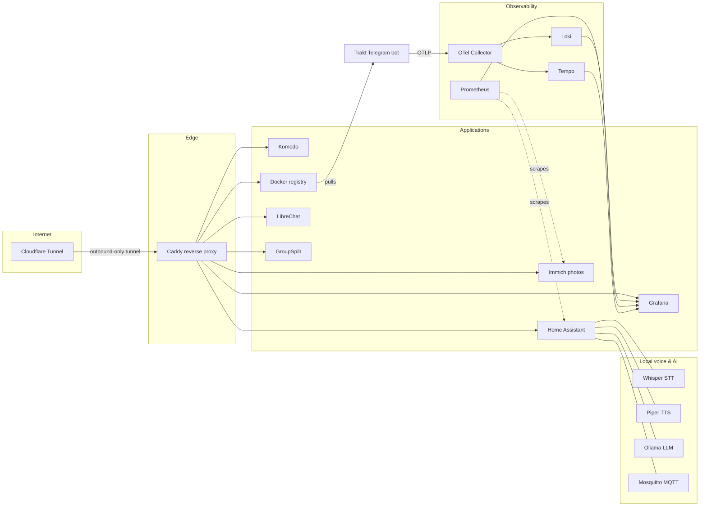

# 🏠 Homelab

Infrastructure-as-code for my single-node homelab: ~30 containers across six
Docker Compose stacks (plus a self-deploying app stack), published to the
internet through a Cloudflare Tunnel and fully observable with a
Grafana/Prometheus/Loki/Tempo stack.

Everything needed to rebuild the server from scratch lives in this repo.
Pushing to `main` deploys — but CI is no longer the deployer. Komodo checks
this repo out *on the server* and runs `docker compose` there, triggered by a
GitHub webhook. GitHub Actions builds only the one image that still needs
building (`config-agent`) and then tells Komodo to deploy, in that order, so an
image is never pulled before it exists. Only the data stays on the machine, and
each stack's secrets live in a `.env` beside its checkout rather than in GitHub.
For stacks that interpolate those values into Compose, Komodo's normalized
config log can still contain them; LibreChat's secret delivery is not yet
closed out.

## Architecture


```mermaid
flowchart LR
    subgraph internet[Internet]
        CF[Cloudflare Tunnel]
    end

    subgraph edge[Edge]
        CADDY[Caddy reverse proxy]
    end

    CF -->|outbound-only tunnel| CADDY

    subgraph apps[Applications]
        IMMICH[Immich photos]
        HA[Home Assistant]
        GRAFANA[Grafana]
        KOMODO[Komodo]
        REGISTRY[Docker registry]
        LIBRECHAT[LibreChat]
        GROUPSPLIT[GroupSplit]
    end

    CADDY --> IMMICH
    CADDY --> HA
    CADDY --> GRAFANA
    CADDY --> KOMODO
    CADDY --> REGISTRY
    CADDY --> LIBRECHAT
    CADDY --> GROUPSPLIT

    subgraph voice[Local voice & AI]
        WHISPER[Whisper STT]
        PIPER[Piper TTS]
        OLLAMA[Ollama LLM]
        MQTT[Mosquitto MQTT]
    end

    HA --- WHISPER
    HA --- PIPER
    HA --- OLLAMA
    HA --- MQTT

    subgraph obs[Observability]
        PROM[Prometheus]
        LOKI[Loki]
        TEMPO[Tempo]
        OTEL[OTel Collector]
    end

    BOT[Trakt Telegram bot] -->|OTLP| OTEL
    OTEL --> TEMPO
    OTEL --> LOKI
    PROM --> GRAFANA
    LOKI --> GRAFANA
    TEMPO --> GRAFANA
    PROM -.scrapes.-> HA
    PROM -.scrapes.-> IMMICH
    REGISTRY -->|pulls| BOT
```

No inbound ports are open on the router: `cloudflared` maintains an
outbound-only tunnel to Cloudflare, which routes published hostnames to
Caddy, which reverse-proxies to each service over a shared Docker bridge
network (`internal`). DNS is a wildcard `*.{domain}` CNAME at the tunnel, so
what actually decides whether a hostname is public is the tunnel's own ingress
list (Zero Trust → Networks → Tunnels → Public Hostnames), which ends in
`http_status:404` — publishing a service means adding it *there* as well as in
the Caddyfile. TLS terminates at Cloudflare's edge, so every site block is
`http://` and origins see plain HTTP — an app that decides anything from the
request scheme (secure cookies, redirect URLs) has to be told the real one, and
Caddy overwrites `X-Forwarded-Proto` with the scheme it was reached on unless
`trusted_proxies` says otherwise. The tunnel runs
in its own host-managed compose, separate from every control plane, so no
deploy — CI's or Komodo's — can take down the route used to repair it.

## Stacks

| Stack | What it runs | Why |
|---|---|---|
| [config/](config/) | Caddy 2.8 + config-agent | Reverse proxy for every published service, plus the one container that copies repo config (HA yaml, mosquitto.conf) into the live dirs and pushes UI edits back to git. Deployed by Komodo; the only stack CI still touches, because `config-agent` is a built image |
| [immich/](immich/) | Immich v3, Postgres (pgvector), Valkey, ML service | Self-hosted Google Photos replacement with on-device ML. Deployed by Komodo from this repo on a GitHub webhook, not by CI |
| [home-assistant/](home-assistant/) | Home Assistant, Mosquitto, Whisper, Piper, Ollama | Smart home with a fully local voice assistant pipeline (STT → LLM → TTS). Deployed by Komodo from this repo on a GitHub webhook, not by CI; `ha-config/` and `mosquitto/` are synced separately by config-agent |
| [monitoring/](monitoring/) | Prometheus, Grafana, Loki, Tempo, OTel Collector, Promtail, cAdvisor, node-exporter | Metrics, logs, and traces for the host and every container. Deployed by Komodo from this repo on a GitHub webhook, not by CI; each service's config is bind-mounted from the checkout rather than baked into an image |
| [registry/](registry/) | Docker Registry 2 | Private image registry for my own builds. Deployed by Komodo from this repo on a GitHub webhook, not by CI — the first stack to move |
| [tunnel/](tunnel/) | cloudflared | The Cloudflare Tunnel every published service is reached through. Host-managed, never deployed — a bad deploy of the stack holding the tunnel would remove the path used to repair it |
| [komodo/](komodo/) | Komodo Core + Periphery + MongoDB | The control plane: clones this repo on the server and deploys every stack above from it. Host-managed, never CI-deployed |
| [librechat/](librechat/) | LibreChat, MongoDB, Meilisearch, RAG parser + pgvector | Chat front-end over a Microsoft Foundry deployment. A Komodo-owned stack with checkout-mounted config; secret delivery remains under evaluation |

Two more stacks run on the server but are deliberately **not** defined here.
The first,
[traktv-tg-bot](https://github.com/lorainemg/traktv-tg-bot) (my Telegram bot
for Trakt.tv + Postgres 17 + Aspire dashboard), generates its compose file
with .NET Aspire and deploys itself from its own repo's CI through the Komodo
API: a `trakt-tg-bot` Stack in `file_contents` mode that CI creates on its
first run if missing, then fills and deploys on every push. CI holds a key for
the `trakt-tg-bot-ci` service user, which has Read + Attach on the server
(what creating a stack there needs — Komodo lets non-admins create stacks
unless `KOMODO_DISABLE_NON_ADMIN_CREATE` is set) and is granted Write on the
stack automatically as its creator. No sync TOML may declare this Stack: sync
resets any field it doesn't declare, and this Stack's contents are CI's.
Beyond that seam this repo only documents it (the monitoring stack joins its
network to collect telemetry). One sharp edge to know: Aspire derives the Postgres volume
name from an apphost hash, so an Aspire CLI update can silently point the stack
at a fresh empty volume — the old data survives under the previous name, and
the fix is naming the volume explicitly in the AppHost.

The second is **group-split** (`group-split-web`, `api`, `keycloak`, Postgres
and an Aspire dashboard), which follows the same pattern from its own repo's
CI. Its Stack is likewise absent from `komodo/stacks.toml` for the same reason
the bot's is, and unlike the bot it *is* published: its `web` container joins
`internal`, so [config/caddy/Caddyfile](config/caddy/Caddyfile) reverse-proxies
`groupsplit.<domain>` to `group-split-web:8080`. That one line is the whole
seam — the compose file, the image tags and the other three containers belong
to that repo. Its Keycloak is not published, so browser-facing login is not
reachable from outside the LAN yet (see [LEARNING.md](LEARNING.md)).

Highlights:

- **Local voice assistant** — Home Assistant's Assist pipeline wired to
  Wyoming Whisper (speech-to-text), Wyoming Piper (text-to-speech) and a local
  Llama 3.2 model served by Ollama. No cloud round-trip.
- **Full observability** — the Trakt bot ships traces/logs over OTLP to an
  OpenTelemetry Collector that fans out to Tempo, Loki and an Aspire
  dashboard; Prometheus scrapes the host, every container (cAdvisor), Home
  Assistant and Immich; Grafana ties it all together.
- **Self-hosted CI artifact flow** — the
  [Trakt bot](https://github.com/lorainemg/traktv-tg-bot)'s images are built
  by .NET Aspire's deployment pipeline in GitHub Actions and pushed to the
  self-hosted registry the server then pulls from.

## Repo layout

```
├── .agents/skills/   agent-readable runbooks (adding-a-stack); .claude/skills symlinks here
├── .github/workflows/deploy.yml   build config-agent → tell Komodo to deploy
├── config/           docker-compose.yml, .env.example
│   ├── caddy/        Caddyfile, mounted into Caddy straight from the checkout
│   └── config-agent/ the one config container: repo → live sync + hourly UI-edit backup
├── immich/           docker-compose.yml, .env.example
├── home-assistant/   docker-compose.yml, .env.example
│   ├── ha-config/    HA yaml config (automations, scripts, scenes, ...)
│   └── mosquitto/    mosquitto.conf (passwd file is generated, not committed)
├── monitoring/       docker-compose.yml, .env.example
│   ├── prometheus/   prometheus.yml, entrypoint (HA token via env)
│   ├── promtail/     promtail.yml
│   ├── tempo/        tempo.yml
│   └── otelcol/      otel-collector.yml
├── registry/         docker-compose.yml (deployed by Komodo, not CI)
├── tunnel/           docker-compose.yml (cloudflared), .env.example
├── komodo/           docker-compose.yml (Core + Periphery + Mongo), .env.example
├── librechat/        docker-compose.yml, config/librechat.yaml, .env.example (deployed by Komodo)
└── scripts/          bootstrap.sh, pre-commit (gitleaks)
```

Conventions:

- **Config mounted from the checkout, state on disk.** Komodo clones this repo
  onto the server, so pure config (Prometheus/OTel/Promtail/Tempo, the
  Caddyfile) is bind-mounted straight out of the checkout — nothing is built
  and no container is recreated between an edit and the process reading it.
  Always mount the *directory*, never the file: `git pull` replaces files, and
  a single-file bind mount stays pinned to the original inode forever, serving
  stale config while the host's checkout looks up to date. Config that has to
  sit next to runtime state the app writes itself (HA yaml, mosquitto.conf) is
  still *copied* in by `config-agent`. Stateful directories (photo library, HA
  runtime, Ollama models, databases) live under a data root (`/data` by
  default).
- **Secrets never in git.** Each stack's secrets live in a `.env` beside its
  checkout on the server (`/etc/komodo/stacks/<stack>/<stack>/.env`, root-owned
  `600`), placed once by hand and never transmitted. GitHub Actions holds only
  what CI itself needs: `KOMODO_URL` and `KOMODO_WEBHOOK_SECRET`. The one
  file-based secret (Prometheus's HA token) is materialized at container start
  from an env var by its entrypoint. A gitleaks pre-commit hook backstops it.

## Rebuilding from scratch

1. Install Docker Engine + the Compose plugin; mount/create the data disk at
   `/data`.
2. Restore the data directories from backup (Immich library + DB, HA config,
   etc.) — or start fresh.
3. Create the shared network, then start the tunnel and the control plane —
   the tunnel first, since everything else is published through it. Copy
   `tunnel/.env.example` to `tunnel/.env` and fill in the tunnel token, then
   `docker network create internal && docker compose --project-directory tunnel up -d && docker compose --project-directory komodo up -d`.
   Point the tunnel's public hostnames — `komodo.<domain>`, `immich.<domain>`,
   `grafana.<domain>`, … — at `http://caddy:80`.
4. Set the repo's Actions secrets: `KOMODO_URL` and `KOMODO_WEBHOOK_SECRET`
   (the value of `KOMODO_WEBHOOK_SECRET` in `komodo/.env`). That is everything
   CI needs — every other secret lives on the host now.
5. The Stacks themselves need no clicking: bootstrap pointed Komodo at
   [komodo/stacks.toml](komodo/stacks.toml) (a ResourceSync) and ran the first
   sync, which creates every Stack with its `project_name` **exactly** the
   directory name — so an existing server's volumes (`<project>_<volume>`) are
   adopted rather than recreated empty. The `trakt-tg-bot` Stack is the
   exception: its own repo's CI creates it on first run (see above), which
   needs the `trakt-tg-bot-ci` service user recreated by hand with an API key
   and Read + Attach on the server. Per-stack deploy behaviour
   (`webhook_force_deploy`, `post_deploy` restarts for processes that don't
   hot-reload their config) lives in that file too. What remains by hand:
   copy each stack's `.env.example` to
   `/etc/komodo/stacks/<stack>/<stack>/.env` and fill it in, deploy each
   Stack, and add the GitHub webhooks — one per stack at
   `<KOMODO_URL>/listener/github/stack/<name>/deploy`, plus one at
   `<KOMODO_URL>/listener/github/sync/homelab/sync` so a push that edits
   `stacks.toml` applies itself (secret for all: `KOMODO_WEBHOOK_SECRET`).
6. Mosquitto users are the one manual step:
   `docker exec mosquitto mosquitto_passwd -c /mosquitto/config/passwd homeassistant`
7. LibreChat accounts are the other one. Registration is disabled on a
   public hostname, so the first account is made from the host with
   `docker exec -it librechat npm run create-user` — there is never a window
   where the login page accepts signups.

`./scripts/bootstrap.sh` automates steps 3 and 5's Komodo half: it creates the
shared network, refuses to start if `tunnel/.env` or `komodo/.env` is missing,
brings up those two stacks, then seeds the control plane — the ResourceSync
pointing at `komodo/stacks.toml` (running the first sync, which creates every
Stack). Steps 4-6's remaining hand work
(`.env` files, webhooks, Mosquitto users) finishes the rebuild. If you need a stack up with no
control plane at all — Komodo itself broken, say — its compose file still runs
standalone: `docker compose --project-directory <stack> up -d`, with that
stack's `.env` beside it.

LibreChat's `config/` directory is mounted from the Komodo checkout and
`CONFIG_PATH` points at its YAML file. A config-only commit therefore needs the
forced webhook and post-deploy restart described above.

Home Assistant's HACS custom components (`better_thermostat`, `browser_mod`,
`extended_openai_conversation`, `hacs`, `monitor_docker`, `roborock_custom_map`,
`smartrent`, `teamtracker`, and friends) are reinstalled through
[HACS](https://hacs.xyz/) rather than committed — the 128 MB of vendored
code doesn't belong in git.

## Contributing to it (a.k.a. me, later)

Adding a new stack — or moving one between deploy methods — is written up in
[.agents/skills/adding-a-stack/SKILL.md](.agents/skills/adding-a-stack/SKILL.md):
a decision table for the four methods, a checklist per method, and the traps
that have already caught us. It's in the cross-vendor `.agents/skills/` location
so Codex and Copilot load it too; `.claude/skills` is a symlink to it.

Enable the secret-scanning hook once per clone:

```sh
cp scripts/pre-commit .git/hooks/pre-commit && chmod +x .git/hooks/pre-commit
```

## CI/CD ([deploy.yml](.github/workflows/deploy.yml))

Most pushes to `main` never touch a runner. Komodo holds one GitHub webhook per
stack; a push makes it pull this repo on the server and run `docker compose up
-d` for that stack, so a config edit reaches the running container with no build
and no image in between.

CI exists for the one thing that still needs a runner — building `config-agent`
— and is a single job:

1. **Change detection** — [dorny/paths-filter](https://github.com/dorny/paths-filter)
   checks `config/config-agent/**`. If it's untouched, every later step is
   skipped and the run is green having done nothing.
2. **Image build** —
   [docker/build-push-action](https://github.com/docker/build-push-action)
   rebuilds and pushes `ghcr.io/lorainemg/homelab/config-agent` (tagged
   `latest` + commit SHA for rollbacks).
3. **Deploy trigger** — a signed POST to Komodo's listener for the `config`
   stack, in the same job and strictly after the build, so Komodo can never
   pull an image GHCR doesn't have yet. The body must carry a `ref` matching
   the stack's branch: Komodo filters on it and ignores a payload without one
   while still answering `200`.

`workflow_dispatch` rebuilds and redeploys unconditionally — the
fresh-server / changed-agent button.

Config that can't simply be mounted flows through the `config-agent` container
in the config stack. HA yaml and `mosquitto.conf` are mounted read-only from
Komodo's checkout at `/src` and copied into the live dirs (keeping the previous
version in `.sync-backup/` next to each), because Home Assistant writes to those
same directories itself; HA is then reloaded — or restarted, when
`configuration.yaml` changed — through its API. The Caddyfile no longer goes
through the agent at all: Caddy mounts `config/caddy/` from the checkout and
`--watch` reloads it in place, so a Caddyfile edit never recreates the caddy
container and can't sever the tunnel → caddy → Komodo path a deploy's own
response travels through. Editing the config stack's compose file itself — a
caddy version bump, say — does recreate it, and that one deploy is expected to
lose its response.
The flow is two-way: the same agent commits UI-made edits (automations,
scripts, scenes, helpers) back to this repo once an hour with `[skip ci]`,
so nothing is lost between deploys. Runtime state (`.storage/`, databases,
`custom_components/`, Mosquitto's `passwd`) is never touched — back that
layer up with HA's built-in automatic backups.
